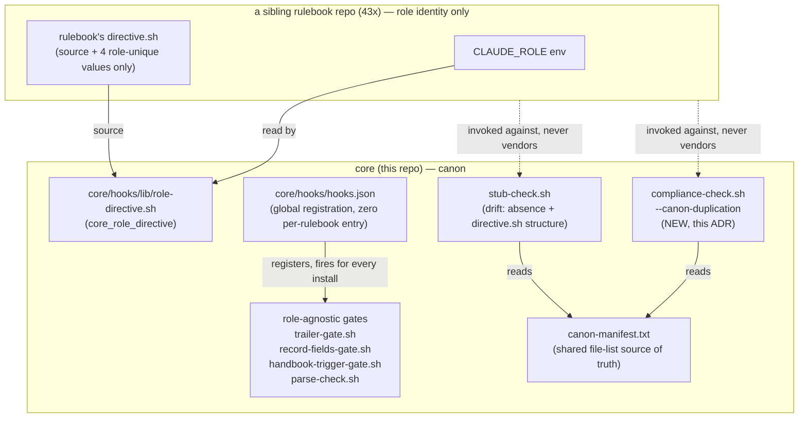

# Decision: role-agnostic canon boundary (issue-66)

## Context

Implementation (PRs #67/#68, merged 2026-07-31) already promoted the four
role-agnostic gate/hook files (`trailer-gate.sh`, `record-fields-gate.sh`,
`handbook-trigger-gate.sh`, `directive.sh`'s boilerplate half) to
`core/hooks/`, registered them core-side (`core/hooks/hooks.json`, zero
per-rulebook config), and shipped `stub-check.sh` as a drift-recurrence
detector. What was missing was the boundary decision itself in record form,
and closing a gap against the issue's literal acceptance check: it names
`core/hooks/tests/compliance-check.sh` as the surface that should gain a
canon-duplication scan "runnable against an arbitrary rulebook path" —
`stub-check.sh` is a different, narrower script (invoked per-rulebook, not
from this repo). See `docs/issue-66/reports/architecture/survey.md` for the
full current-state survey.

## Decision

1. **Component boundary.** Core canon (`core/hooks/`,
   `core/hooks/tests/`) owns all role-agnostic gate/hook *logic*. A
   rulebook owns only role identity (`CLAUDE_ROLE` env) and its four
   `directive.sh` role-unique values. No rulebook-local file may
   re-implement logic that already has a core canon home — the presence of
   such a file is itself the defect, not a stylistic choice
   (`docs/handbooks/canon-scripts.md`'s "referenced, never copied" clause
   is the standing statement of this rule; this decision is its
   issue-66-scoped ADR).

2. **Dependency direction.** Rulebooks depend on core canon, via
   `${CLAUDE_PLUGIN_ROOT}/hooks/*` path resolution and `source
   core/hooks/lib/role-directive.sh`. Never the reverse. Core canon carries
   no per-rulebook branching beyond the `CLAUDE_ROLE` string itself.

3. **Acceptance-gap closure.** `core/hooks/tests/compliance-check.sh`
   gains a `--canon-duplication <rulebook-path>` mode: it reads
   `canon-manifest.txt` (already `stub-check.sh`'s source of truth for the
   canon-file list) and reports, per manifest filename, whether a copy
   exists anywhere under the given rulebook path — nonzero exit if any
   copy is found. Reusing the manifest means the two scripts' file lists
   cannot drift against each other; the mode's detection logic
   (find-by-filename against a manifest-driven list) is deliberately the
   same shape `stub-check.sh` already uses, not a second implementation
   invented independently.

4. **#63 stays separate.** Per the phase-1 survey verdict, #63 (promote
   `warrant-hunter.md` + hunt-cadence protocol to core canon, plus its own
   undelivered efficiency-protocol redesign) is not absorbed by #66. Only
   the *rollout batching* — touching the same 43 sibling repos once
   instead of twice — is shared; that is a scheduling note (see the
   rollout doc), not a scope merge. #63 keeps its own issue and its own
   phase-1/phase-2 cycle.

## C4 — component boundary

Dependency direction is one-way: rulebook → core. Core never reads
rulebook-specific config beyond `CLAUDE_ROLE`, and no arrow points from
core into a rulebook's own tree.

## Alternatives considered

- **Leave `compliance-check.sh` gap unaddressed, treat `stub-check.sh` as
  sufficient.** Rejected — the issue's acceptance text explicitly names
  `compliance-check.sh`; `stub-check.sh` alone leaves that literal
  criterion unmet and gives this repo no single-command way to audit an
  arbitrary external rulebook path.
- **Merge #63 into #66's write scope to shortcut the rollout-batching note
  into one issue.** Rejected — #63 has undelivered scope of its own
  (measurement, an efficiency-protocol redesign, a side-effect catch-class
  audit) that #66 never touched; forcing it under #66 would either drop
  that scope or scope-creep #66 past what was asked.
- **Per-rulebook config file (a canon-version pin) instead of
  file-presence/structure detection.** Rejected at this stage — adds a new
  43-repo artifact type for a problem `stub-check.sh` already solves by
  absence/structure convention; revisit only if that convention proves
  insufficient in practice.
- **A second, independent duplication-scan implementation in
  `compliance-check.sh` instead of reusing `canon-manifest.txt`.**
  Rejected — two independently-maintained file lists is exactly the drift
  class this ADR exists to close off; one manifest, two readers.

## Consequences

- Positive: single source of truth for role-agnostic gate logic; the
  issue's acceptance criterion becomes literally satisfiable from this
  repo; drift detection now has two independent entry points
  (`stub-check.sh` inside a rulebook's own harness, `compliance-check.sh`
  from core) reading one shared manifest.
- Negative / cost: `canon-manifest.txt` is now a dependency of two
  scripts instead of one — an edit to the manifest must be verified
  against both call sites (mitigated by both reading the same file rather
  than hand-copied lists, so no edit can update one and miss the other).
- Risk carried forward: the 43-repo rollout itself remains unexecuted from
  this repo (no write access) until batched with #63 per the rollout doc;
  canon and any still-vendored copies coexist until each rulebook's own
  rollout lands — drift is *detectable* repo-by-repo but not yet
  *eliminated* across all 43 until that rollout runs.

## Hand-off

CLI-surface detail for `--canon-duplication` beyond a path arg is not
needed (single positional arg, no interface design surface) — no
api-design hand-off. No performance budget implicated.
