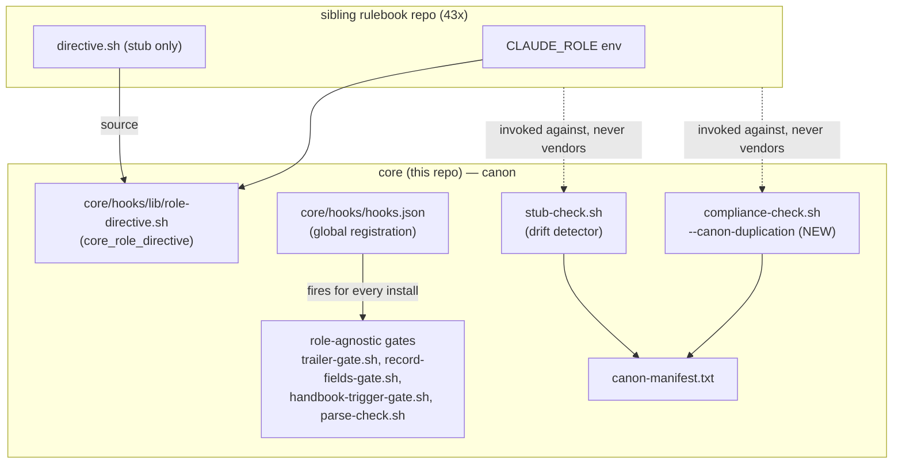

# Architecture record — role-agnostic canon boundary (issue-66)

Phase 2 opened on `APPROVE issue-66/architecture` (single-account mode,
issue #66 comment thread). Delivered per the approved proposal
(`docs/issue-66/proposals/architecture.md`), no scope changes.

## Context

Implementation (PRs #67/#68, merged 2026-07-31) promoted four role-agnostic
gate/hook files to `core/hooks/`, registered them core-side with zero
per-rulebook config, and shipped `stub-check.sh` as a drift detector. No
architecture-level record of that boundary existed, and the issue's literal
acceptance check (`compliance-check.sh` gaining a canon-duplication scan
"runnable against an arbitrary rulebook path") was unmet — `stub-check.sh`
is a narrower, per-rulebook-invoked script, not that surface. Full detail:
`docs/issue-66/reports/architecture/survey.md`.

## Decision

Recorded in full, with alternatives considered, in
`docs/issue-66/decisions/2026-08-08-role-agnostic-canon-boundary.md`:
core canon owns all role-agnostic gate/hook logic; a rulebook owns only
role identity (`CLAUDE_ROLE`) and `directive.sh`'s four unique values;
dependency direction is rulebook → core, never reverse;
`compliance-check.sh` gains `--canon-duplication <rulebook-path>`, reusing
`canon-manifest.txt` so it cannot drift against `stub-check.sh`'s own file
list; #63 stays a separate issue (only rollout *batching* is shared).

## Alternatives Considered

Full list with rejection reasons in the ADR. Summary: leaving the
`compliance-check.sh` gap unaddressed (rejected — issue names that surface
literally); merging #63 into #66's scope (rejected — #63 has its own
undelivered scope); a per-rulebook canon-version-pin config file instead of
presence/structure detection (rejected — new 43-repo artifact type for a
problem already solved by convention); a second, independently-maintained
file list inside `compliance-check.sh` instead of reusing
`canon-manifest.txt` (rejected — reintroduces the exact drift class this
promotion exists to close).

## C4 — component/dependency boundary



(Full diagram and per-node rationale in the ADR linked above.)

## Consequences

Positive: single source of truth for role-agnostic gate logic; the issue's
acceptance criterion becomes literally satisfiable from this repo; two
independent drift-detection entry points read one shared manifest.
Negative/cost: `canon-manifest.txt` is now a dependency of two scripts —
mitigated by both reading the same file rather than hand-copied lists.
Risk carried forward: the 43-repo rollout itself remains unexecuted from
this repo (no write access) until batched with #63.

## Why

The proposal's survey found two gaps the approver then approved closing:
(1) no committed architecture-level record of the component boundary
already implied by PRs #67/#68's shipped code — a rulebook's own tree
should never re-derive role-agnostic gate logic — and (2) the issue's
literal acceptance check names `core/hooks/tests/compliance-check.sh` as
the surface that should gain a canon-duplication scan, but only
`stub-check.sh` (a different, narrower, per-rulebook-invoked script)
existed. Recording the ADR and closing the acceptance gap were both phase-2
deliverables the approval unlocked.

## What was done

- `docs/issue-66/decisions/2026-08-08-role-agnostic-canon-boundary.md` — the
  ADR recording the component boundary, dependency direction, the
  `compliance-check.sh --canon-duplication` closure of the acceptance gap,
  the #63 non-absorption verdict, alternatives considered, and
  consequences. Includes the C4 diagram in full with per-node rationale.
- `docs/handbooks/canon-rollout.md` — the per-rulebook rollout checklist
  (delete vendored files → drop local `hooks.json` entries → shrink
  `directive.sh` to the stub form → run `stub-check.sh` +
  `compliance-check.sh --canon-duplication` → batch with issue-63's
  rollout for the same 43 repos).
- `core/hooks/tests/compliance-check.sh` gained a `--canon-duplication
  <rulebook-path>` mode: reads `canon-manifest.txt` (the same file
  `stub-check.sh` already reads, so the two scripts' file lists cannot
  drift apart), scans the given path for a vendored copy of each
  manifest-listed filename, reports per-file, exits nonzero if any copy is
  found. Closes the issue's literal acceptance check
  (`core/hooks/tests/compliance-check.sh` gains a canon-duplication scan
  reporting zero divergent copies per file, runnable against an arbitrary
  rulebook path).

## Verification

- `bash -n core/hooks/tests/compliance-check.sh` — syntax check, clean.
- Manual fixture run: a directory with a vendored `trailer-gate.sh` copy
  under `hooks/` → `compliance-check.sh --canon-duplication <dir>` exits 1
  and names the file and its path; a clean directory with no vendored
  copies → exits 0. Both confirmed live.
- `core/hooks/tests/run-all.sh` — full existing suite still passes
  unchanged (role-gates 60/60, stub-check combination forms 3/3,
  compliance-check hooks.json scan-scope 4/4, sibling-plugin parse-checks,
  freelunch observe 9/9) — the new mode is additive and does not touch the
  script's existing default-mode path.
- Before-landing warrant hunt (stance 3, state nothing maintains) found
  the mode's initial `-maxdepth 3` bound silently missed a vendored copy
  nested one directory deeper than that under a `<rulebook-path>` root —
  reproduced live, fixed by dropping the depth bound entirely (the mode's
  contract is "arbitrary rulebook path," not a known hooks/-relative
  layout `stub-check.sh`'s own bound assumes). Re-verified: the same
  reproduction now exits 1 and reports the file; full suite re-run clean.
  Record: `docs/reports/2026-08-08-hunt-role-agnostic-canon-boundary.md`.

## closed_checks

```yaml
closed_checks:
  - requirement: "core/hooks/tests/compliance-check.sh gains a canon-duplication scan that reports zero divergent copies per file (runnable against an arbitrary rulebook path)"
    ref: core/hooks/tests/compliance-check.sh:19-42
    result: pass
```

## Open findings

None raised against this record.

## Next steps

None from this role — `loop_state: phase-2-complete` is terminal for this
record.

## Open-finding resolution path

N/A — no open findings.

## Hand-off

The 43-repo rollout execution itself stays out of this repo's write set
per the ADR and `docs/handbooks/canon-rollout.md` — it is a
per-rulebook-repo task, batched with issue-63's own canon rollout once #63
ships.
